<div align="center">


```
╭──────────────────────────────────────────────────────────────────╮
│  root@lord-of-the-strings                              tty1      │
├──────────────────────────────────────────────────────────────────┤
│  OS:         Sentient(ish) x86_64                                 │
│  Host:       github.com/lord-of-the-strings                       │
│  Kernel:     6.9.1-string-theory                                   │
│  Shell:      zsh --with-opinions                                   │
│  WM:         Hyprland (floating, animated, unapologetic)            │
│  Theme:      Tokyo Night [Storm] + neon-green overclock             │
│  Terminal:   kitty, 0.94 opacity, blur(22)                          │
│  CPU:        caffeine (99% load, always)                            │
│  Uptime:     since before semicolons made sense to me                │
╰──────────────────────────────────────────────────────────────────╯
```


</div>

<h2 align="center">
  
</h2>

<div align="center">


</div>

---

### `~/about.formal --no-truncate`

I engineer systems the way one tunes an instrument: by ear, under pressure, and with an unreasonable attention to the silence between notes. My work lives at the intersection of correctness and composition.

I hold the position, formally, that a terminal is a stage; that a floating window animation is a thesis statement; and that any dashboard rendered on a light background is, at minimum, a cry for help.

<div align="center">

</div>

### `~/skills --render=neon`

<div align="center">



</div>

<div align="center">

**stack, for the record**


</div>

<div align="center">

</div>

### `~/currently --status`

```yaml
building:    something scheduled to be rewritten in rust eventually
debugging:   a race condition visible only when unobserved
listening:   at a volume too low to justify the headphones
reading:     other people's commit messages, for the drama
compiling:   patience, from source, again
```

<div align="center">


*connect, fork, or open a pull request - let's connect with do'cracy*

</div>
