<div align="center">


```
     ████████        ██████████      root@lord-of-the-strings
   ████    ████     ████              -------------------------
   ████    ████     ████              OS: no idea
   ████    ████       ████████        Host: github.com/lord-of-the-strings
   ████████████               ████    Kernel: also no idea
   ████    ████               ████    Shell: constantly changing
   ████    ████     ████    ████      WM: no attention paid
   ████    ████       ████████        Terminal: whatever
                                       CPU: caffeine @ 99% load (always)
                                       Memory: 2GiB thoughts / 640KiB regrets
                                       Theme: Tokyo Night [Storm] + neon overclock
                                       Motto: constant explorer of uncharted seas

                                       ● ● ● ● ● ● ● ●
```


</div>

### `~/boot --sequence --verbose`

<div align="center">



</div>

<div align="center">

</div>

<h2 align="center">
  
</h2>

<div align="center">


</div>

---

### `~/about.formal --no-truncate`

I ᴀᴘᴘʀᴏᴀᴄʜ ᴇɴɢɪɴᴇᴇʀɪɴɢ ᴡɪᴛʜ ᴛʜᴇ ᴅɪꜱᴄɪᴘʟɪɴᴇ ᴏꜰ ᴀ ᴄʀᴀꜰᴛꜱᴍᴀɴ ᴀɴᴅ ᴛʜᴇ ᴄᴜʀɪᴏꜱɪᴛʏ ᴏꜰ ᴀN ᴇxᴘʟᴏʀᴇʀ. Mʏ ꜰᴏᴜɴᴅᴀᴛɪᴏɴꜱ ʀᴇꜱᴛ ɪɴ C ᴀɴᴅ Jᴀᴠᴀ, ᴛᴇᴍᴘᴇʀᴇᴅ ʙʏ ᴀ ᴡᴏʀᴋɪɴɢ ᴄᴏᴍᴍᴀɴᴅ ᴏꜰ ᴍᴇᴍᴏʀʏ ᴍᴀɴᴀɢᴇᴍᴇɴᴛ ᴀɴᴅ ᴛʜᴇ ᴅɪᴀɢɴᴏꜱɪꜱ ᴏꜰ ɪᴛꜱ ᴄᴏʀʀᴜᴘᴛɪᴏɴ; ᴀɴᴅ ᴇxᴛᴇɴᴅᴇᴅ ᴛʜʀᴏᴜɢʜ Pʏᴛʜᴏɴ, ᴡʜᴇʀᴇ ꜰʟᴜᴇɴᴄʏ ɪꜱ ꜱᴇᴄᴏɴᴅ ɴᴀᴛᴜʀᴇ.

Eʟꜱᴇᴡʜᴇʀᴇ, I ʀᴇᴍᴀɪɴ ᴀ ᴅᴇʟɪʙᴇʀᴀᴛᴇ ʟᴇᴀʀɴᴇʀ: ɪɴ Rᴜꜱᴛ, ɪɴ ᴍᴏᴅᴇʀɴ ᴡᴇʙ ꜰʀᴀᴍᴇᴡᴏʀᴋꜱ, ᴀɴᴅ ɪɴ ᴛʜᴇ ᴍᴀᴄʜɪɴᴇ ʟᴇᴀʀɴɪɴɢ ʟᴀɴᴅꜱᴄᴀᴘᴇ I ᴀᴍ ᴏɴʟʏ ʙᴇɢɪɴɴɪɴɢ ᴛᴏ ᴄʜᴀʀᴛ. Oɴ Lɪɴᴜx: ꜱᴘᴇᴄɪꜰɪᴄᴀʟʟʏ Aʀᴄʜ, ʀᴜɴ ᴅᴀɪʟʏ ᴀɴᴅ ᴡɪᴛʜᴏᴜᴛ ᴀᴘᴏʟᴏɢʏ — I ᴀᴍ ꜰᴜʟʟʏ ᴀᴛ ʜᴏᴍᴇ, ᴡʜɪʟᴇ ᴍʏ ɢʀᴀꜱᴘ ᴏꜰ HTML ᴀɴᴅ CSS ʀᴇᴍᴀɪɴꜱ ᴛʜᴀᴛ ᴏꜰ ᴀ ɢᴇɴᴇʀᴀʟɪꜱᴛ ʀᴀᴛʜᴇʀ ᴛʜᴀɴ ᴀ ꜱᴘᴇᴄɪᴀʟɪꜱᴛ.

<div align="center">

</div>

### `~/skills --render=neon`

<div align="center">


</div>

<div align="center">

**ꜱᴛᴀᴄᴋ, ꜰᴏʀ ᴛʜᴇ ʀᴇᴄᴏʀᴅ**

*Expert*


*Knower*


*Learner*


*Beginner*


</div>

<div align="center">

</div>

### `~/currently --status`

```yaml
building:    something scheduled to be rewritten in rust eventually
debugging:   a race condition visible only when unobserved
listening:   at a volume too low to justify the headphones
reading:     other people's commit messages, for the drama
compiling:   patience, from source, again
```

<div align="center">


*ᴄᴏɴɴᴇᴄᴛ, ꜰᴏʀᴋ, ᴏʀ ᴏᴘᴇɴ ᴀ ᴘᴜʟʟ ʀᴇǫᴜᴇꜱᴛ - ʟᴇᴛ'ꜱ ᴄᴏɴɴᴇᴄᴛ ᴡɪᴛʜ ᴅᴏ'ᴄʀᴀᴄʏ*

</div>
